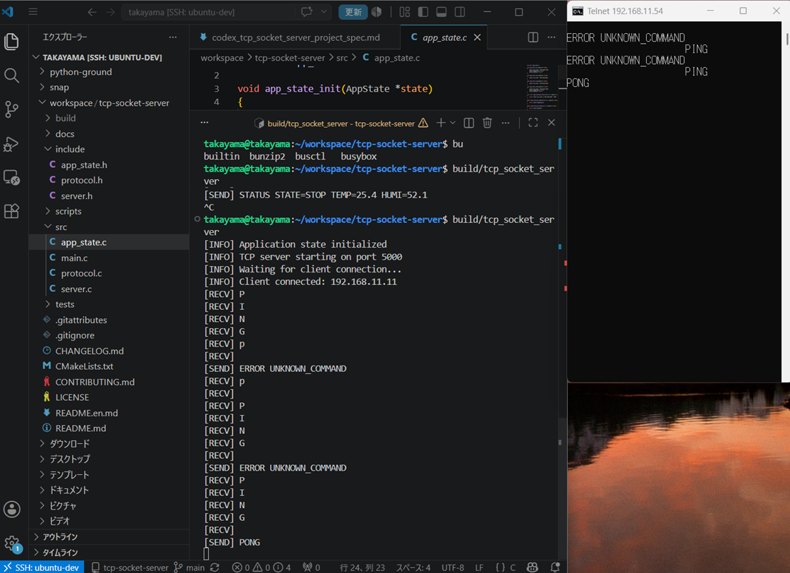
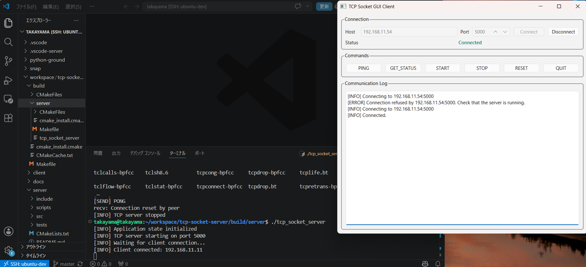
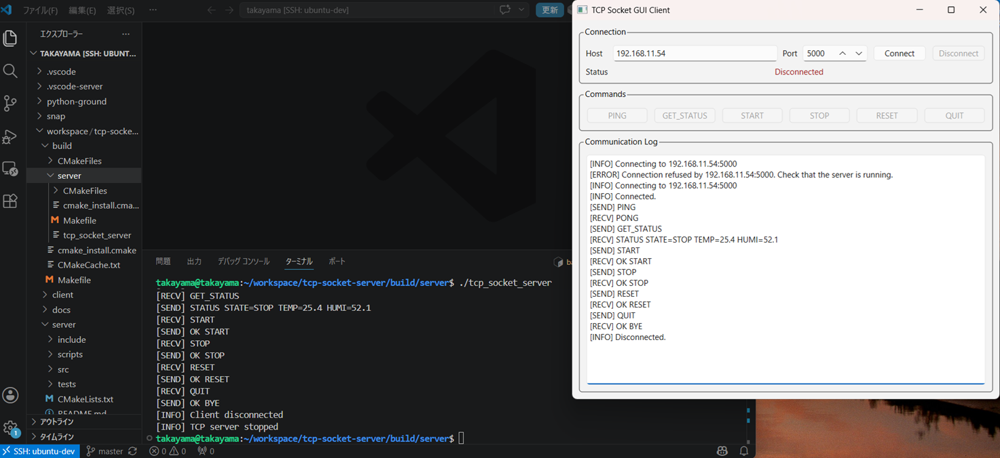

# TCP Socket Control System

[Japanese README](README.md)

A TCP/IP communication learning project with a C TCP server for Ubuntu and Python clients for Windows-side communication checks.

The project is currently complete through **Phase 5: PySide6 GUI TCP Client**.

## System Overview

```text
Windows PC
  client/python/tcp_client.py
  client/python_gui/tcp_gui_client.py
        |
        | TCP/IP
        v
Ubuntu Linux
  build/server/tcp_socket_server
```

The server receives line-based text commands, updates internal state, and returns responses. The client sends commands interactively from Windows.

## Repository Structure

```text
tcp-socket-control-system/
|-- server/
|   |-- include/
|   |-- src/
|   |-- tests/
|   |-- scripts/
|   |-- CMakeLists.txt
|   `-- README.md
|-- client/
|   |-- python/
|   |   |-- tcp_client.py
|   |   `-- README.md
|   `-- python_gui/
|       |-- tcp_gui_client.py
|       |-- requirements.txt
|       `-- README.md
|-- docs/
|   |-- en/
|   |-- ja/
|   `-- images/
|-- CMakeLists.txt
|-- CHANGELOG.md
|-- CONTRIBUTING.md
|-- README.md
|-- README.en.md
|-- LICENSE
`-- .gitignore
```

## Components

- [C TCP server](server/README.md)
- [Python CLI TCP client](client/python/README.md)
- [PySide6 GUI TCP client](client/python_gui/README.md)

## Protocol

Supported commands:

```text
PING
GET_STATUS
START
STOP
RESET
QUIT
```

See [docs/en/protocol_spec.md](docs/en/protocol_spec.md) and [docs/ja/protocol_spec.md](docs/ja/protocol_spec.md) for details.

## Response Check Screenshot



## Phase 5 GUI Check

Connect check:



All command check:



## Roadmap

- [x] Phase 1: Project skeleton
- [x] Phase 2: TCP/IP system design documents
- [x] Phase 2.5: Repository preparation
- [x] Phase 3: C TCP server
- [x] Phase 4: Python CLI TCP client
- [x] Phase 5: PySide6 GUI TCP client
- [ ] Phase 6: Logging and configuration
- [ ] Phase 7: GitHub Actions and unit tests
- [ ] Phase 8: Portfolio release

## Documentation

- English implementation specification: [docs/en/](docs/en/)
- Japanese public documentation: [docs/ja/](docs/ja/)
- Changelog: [CHANGELOG.md](CHANGELOG.md)
- Contributing guide: [CONTRIBUTING.md](CONTRIBUTING.md)
