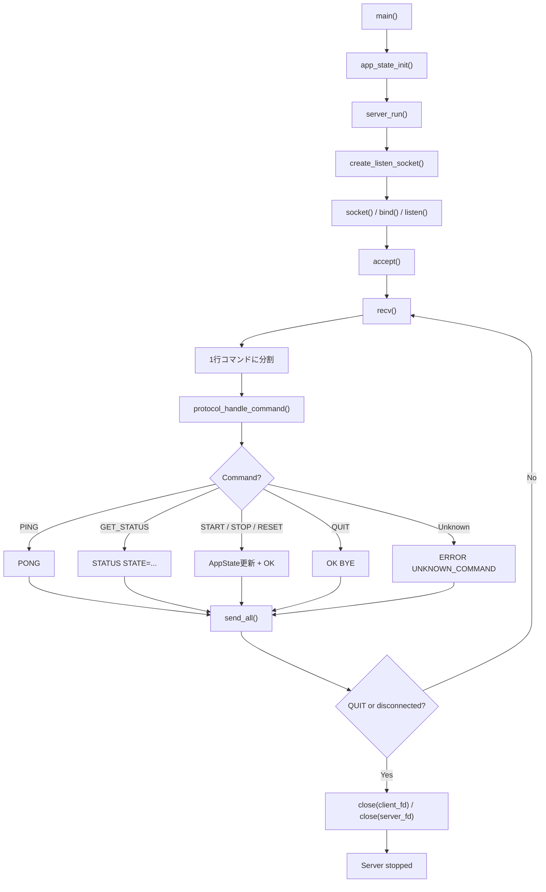
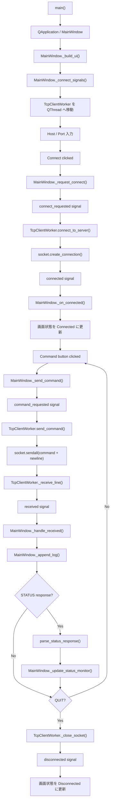
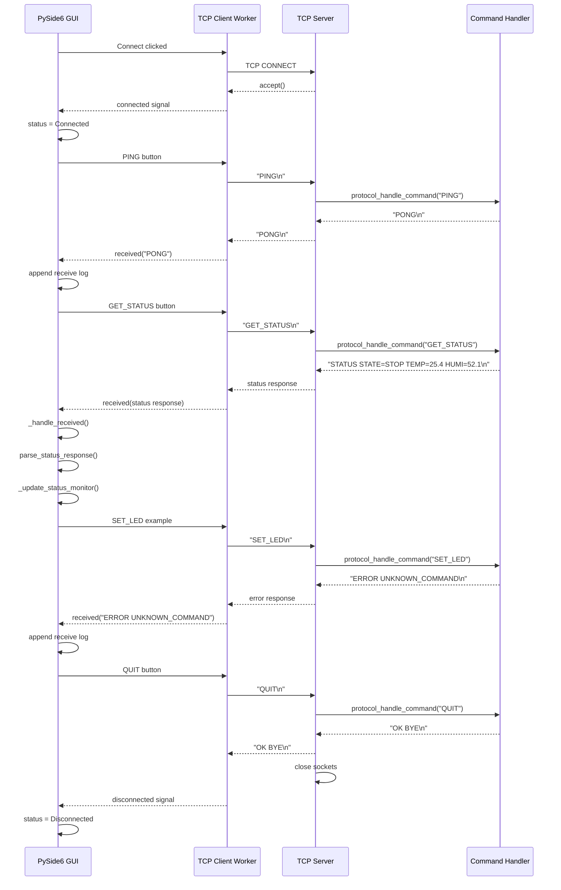

# TCP Socket Control System

[English README](README.en.md)

Ubuntu上のC言語TCPサーバと、Windows側から接続確認できるPythonクライアントを含む、TCP/IP通信学習用プロジェクトです。

現在は **Phase 6: GUIステータスモニタ表示** まで完了しています。

## システム概要

```text
Windows PC
  client/python/tcp_client.py
  client/python_gui/tcp_gui_client.py
        |
        | TCP/IP
        v
Ubuntu Linux
  build/server/tcp_socket_server
```

サーバは行単位のテキストコマンドを受信し、内部状態を更新して応答を返します。クライアントはWindows側から対話モードでコマンドを送信します。

## リポジトリ構成

```text
tcp-socket-control-system/
|-- server/
|   |-- include/
|   |-- src/
|   |-- tests/
|   |-- scripts/
|   |-- CMakeLists.txt
|   `-- README.md
|-- client/
|   |-- python/
|   |   |-- tcp_client.py
|   |   `-- README.md
|   `-- python_gui/
|       |-- tcp_gui_client.py
|       |-- requirements.txt
|       `-- README.md
|-- docs/
|   |-- en/
|   |-- ja/
|   `-- images/
|-- CMakeLists.txt
|-- CHANGELOG.md
|-- CONTRIBUTING.md
|-- README.md
|-- README.en.md
|-- LICENSE
`-- .gitignore
```

## コンポーネント

- [C言語TCPサーバ](server/README.md)
- [Python CLI TCPクライアント](client/python/README.md)
- [PySide6 GUI TCPクライアント](client/python_gui/README.md)

## 通信プロトコル

対応コマンド:

```text
PING
GET_STATUS
START
STOP
RESET
QUIT
```

詳細は [docs/ja/protocol_spec.md](docs/ja/protocol_spec.md) と [docs/en/protocol_spec.md](docs/en/protocol_spec.md) を参照してください。

## 動作確認イメージ


## Phase 5 GUI動作確認

Connect時:


全コマンド確認:


## 処理フロー

### サーバ側フローチャート

C言語TCPサーバの起動、接続待ち、コマンド処理、応答送信、切断までの流れです。



### PySide6クライアント側フローチャート

GUI操作は `MainWindow`、通信処理は `TcpClientWorker` が担当します。socket通信は `QThread` 側で動かし、GUIが固まらないようにしています。



### 通信シーケンス図

PySide6 GUI、TCP通信ワーカー、Cサーバ、コマンド処理部の関係です。`SET_LED` は現行プロトコル未対応の例として表現しています。



## ロードマップ

- [x] Phase 1: プロジェクトの土台
- [x] Phase 2: TCP/IPシステム設計書
- [x] Phase 2.5: リポジトリ公開準備
- [x] Phase 3: C言語TCPサーバ
- [x] Phase 4: Python CLI TCPクライアント
- [x] Phase 5: PySide6 GUI TCPクライアント
- [x] Phase 6: GUIステータスモニタ表示
- [ ] Phase 7: GitHub Actions・単体テスト
- [ ] Phase 8: ポートフォリオ公開整備

## ドキュメント

- 英語版の実装仕様: [docs/en/](docs/en/)
- 日本語版の公開説明: [docs/ja/](docs/ja/)
- 変更履歴: [CHANGELOG.md](CHANGELOG.md)
- 開発参加ルール: [CONTRIBUTING.md](CONTRIBUTING.md)
