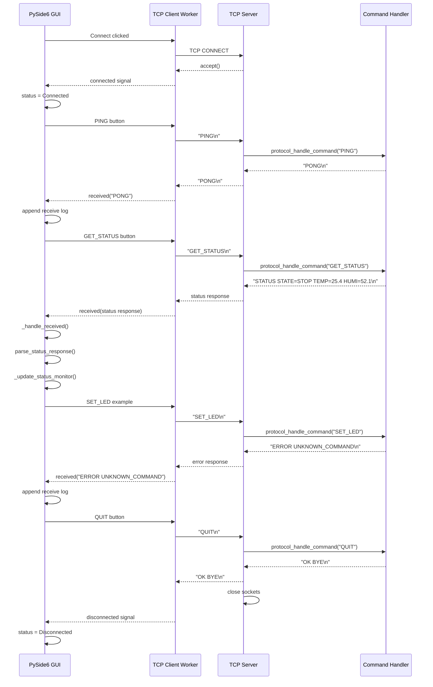
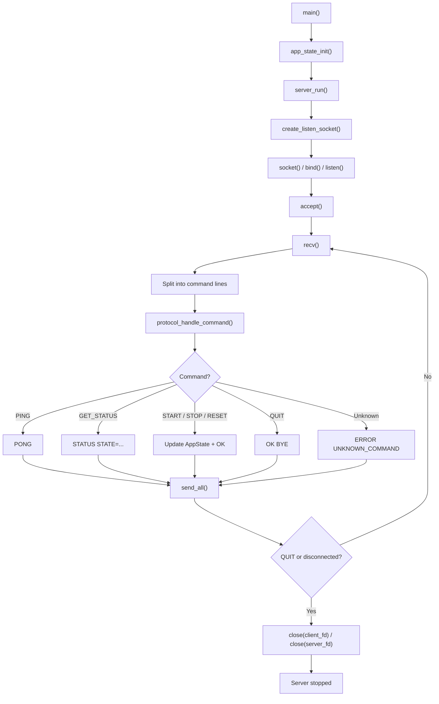
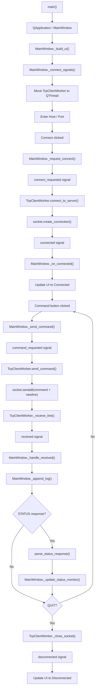

# TCP Socket Control System

[English README](docs/en/README.md) / [日本語ドキュメント](docs/ja/)

## プロジェクト概要

TCP Socket Control System は、Linux 上の C 言語 TCP サーバと、Windows 上の Python GUI クライアントが TCP/IP で通信するポートフォリオ用プロジェクトです。

このプロジェクトでは、以下を実装しています。

- Ubuntu 上で動作する C 言語 TCP Socket Server
- Windows 上で動作する PySide6 GUI Client
- `PING`、`GET_STATUS`、`START`、`STOP`、`RESET`、`QUIT` のテキストベース通信プロトコル
- サーバ応答から `STATE`、`TEMP`、`HUMI` を取り出して表示する Status Monitor
- CMake ビルド、CTest、pytest を実行する GitHub Actions CI

現在は **Phase 8: GitHub Portfolio Refinement** まで完了しています。

## デモ画面


Windows 側の GUI クライアントから、Linux 側の TCP サーバへ TCP/IP で接続して通信しています。

実装済みの機能:

- TCP 接続 / 切断
- `PING` / `PONG`
- `GET_STATUS` 応答の解析
- `START` / `STOP` / `RESET`
- `QUIT`
- Status Monitor
- Communication Log

## システム構成


Windows 11 上の GUI クライアントが、Ubuntu 24.04 LTS 上の TCP サーバへ TCP/IP で接続します。サーバは port `5000` で待ち受け、クライアントから送信された行単位のテキストコマンドに応答します。

## ソフトウェア構成


主な責務:

- `MainWindow`: GUI 表示、ユーザー操作、Status Monitor、Communication Log
- `TcpClientWorker`: 接続管理、コマンド送信、レスポンス受信、GUI への通知
- `TCP Socket Server`: クライアント接続受付、コマンド受信、プロトコル解析、AppState 更新、レスポンス送信
- `AppState`: サーバ内部状態として `STATE`、`TEMP`、`HUMI` を保持

## シーケンス図

PySide6 GUI、TCP 通信ワーカー、C サーバ、コマンド処理部の関係を示します。`SET_LED` は現行プロトコルでは未対応のコマンド例です。



## フローチャート

C 言語 TCP サーバの起動、ソケット作成、クライアント接続、コマンド処理、レスポンス送信、終了までの流れです。



PySide6 クライアントは、socket 通信を `TcpClientWorker` と `QThread` 側で処理し、GUI が固まらないようにしています。



## 技術スタック

### Server

- C
- POSIX Socket
- CMake
- Linux / Ubuntu 24.04 LTS

### Client

- Python 3.10 以上
- PySide6
- Python 標準ライブラリ `socket`

### Development

- Git
- GitHub
- VS Code
- SSH

### CI

- GitHub Actions
- pytest
- CTest

## ディレクトリ構成

```text
tcp-socket-control-system/
|-- .github/
|   `-- workflows/
|       `-- ci.yml
|-- client/
|   |-- python/
|   |   |-- tcp_client.py
|   |   `-- README.md
|   `-- python_gui/
|       |-- tcp_gui_client.py
|       |-- status_parser.py
|       |-- requirements.txt
|       `-- README.md
|-- docs/
|   |-- en/
|   |   `-- README.md
|   |-- ja/
|   `-- images/
|-- server/
|   |-- include/
|   |-- scripts/
|   |-- src/
|   |-- tests/
|   |-- CMakeLists.txt
|   `-- README.md
|-- tests/
|   `-- python/
|-- CMakeLists.txt
|-- CHANGELOG.md
|-- CONTRIBUTING.md
|-- README.md
|-- requirements-dev.txt
`-- LICENSE
```

## Build & Run

### Server

Linux 上で C TCP サーバをビルドします。

```bash
cmake -S . -B build
cmake --build build
```

サーバを起動します。

```bash
./build/server/tcp_socket_server
```

デフォルトでは port `5000` で待ち受けます。

### Python CLI Client

標準ライブラリのみを使う CLI クライアントです。

```bash
python client/python/tcp_client.py --host 192.168.11.54 --port 5000
```

### PySide6 GUI Client

仮想環境を作成し、GUI クライアントを起動します。

```bash
cd client/python_gui
python -m venv .venv
.venv\Scripts\activate
python -m pip install -r requirements.txt
python tcp_gui_client.py
```

Linux または macOS では `.venv\Scripts\activate` の代わりに `source .venv/bin/activate` を使用します。

## GitHub Actions

`push` と `pull_request` のタイミングで GitHub Actions が実行されます。

CI では以下を確認します。

- CMake による C サーバの設定とビルド
- CTest の実行
- pytest による Python 単体テスト

ローカルで同等の確認を行う場合:

```bash
python -m pip install -r requirements-dev.txt
pytest

cmake -S . -B build
cmake --build build
ctest --test-dir build --output-on-failure
```

## ドキュメント

- English README: [docs/en/README.md](docs/en/README.md)
- Server details: [server/README.md](server/README.md)
- CLI client details: [client/python/README.md](client/python/README.md)
- GUI client details: [client/python_gui/README.md](client/python_gui/README.md)
- Protocol specification: [docs/en/protocol_spec.md](docs/en/protocol_spec.md)
- 日本語ドキュメント: [docs/ja/](docs/ja/)
- 変更履歴: [CHANGELOG.md](CHANGELOG.md)
- 開発参加ルール: [CONTRIBUTING.md](CONTRIBUTING.md)

## 今後の拡張候補

- SocketCAN 連携
- STM32 連携
- CSV ログ保存
- 定期ポーリング
- Docker 対応
- 認証機能
