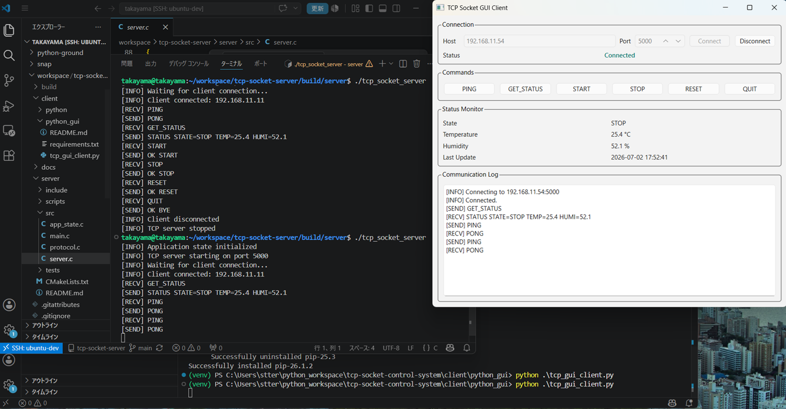
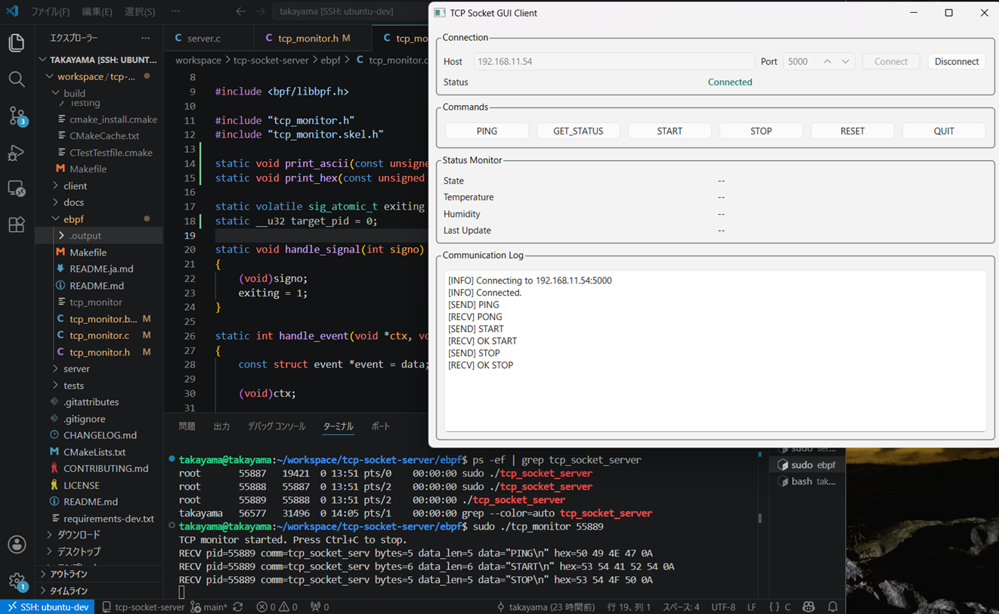
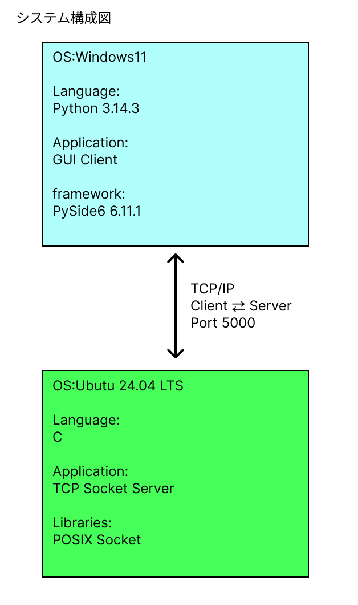
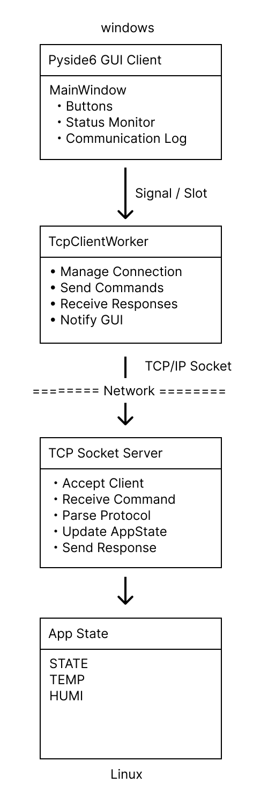
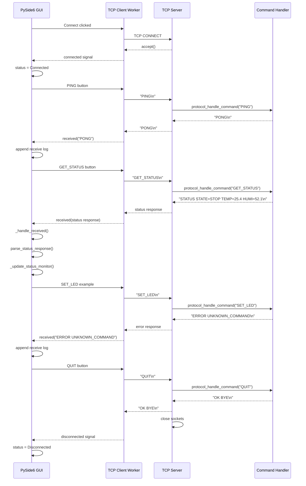
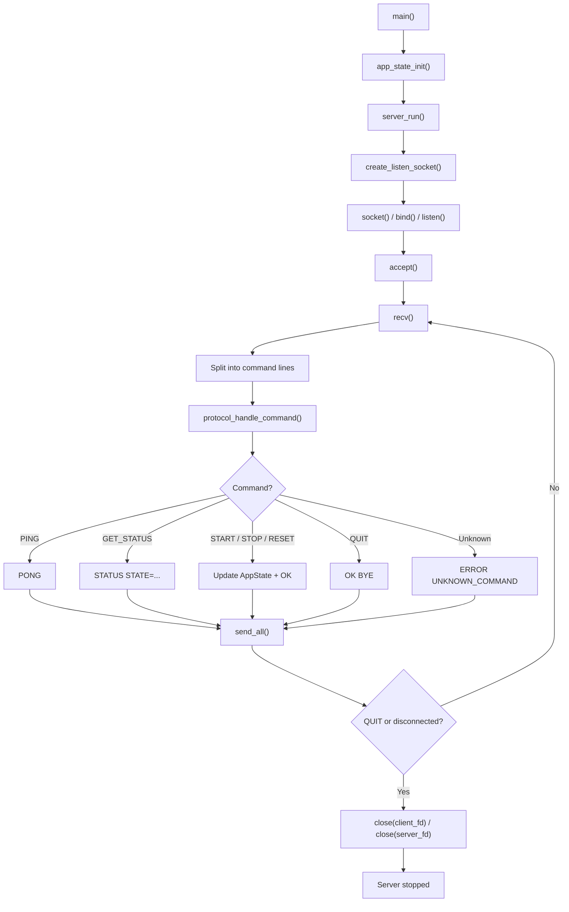
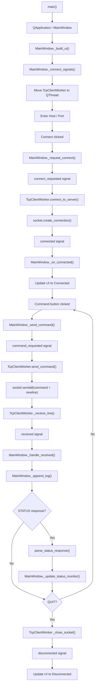

# TCP Socket Control System

[Japanese README](../../README.md) / [Japanese docs](../ja/)

## Project Overview

TCP Socket Control System is a portfolio project that demonstrates TCP/IP communication between a Linux C server and a Windows Python client.

The system includes:

- A TCP socket server implemented in C on Ubuntu.
- A PySide6 GUI client implemented in Python on Windows.
- A command protocol for `PING`, `GET_STATUS`, `START`, `STOP`, `RESET`, and `QUIT`.
- A GUI status monitor that displays `STATE`, `TEMP`, and `HUMI` values received from the server.
- An experimental eBPF TCP monitor that observes Linux `connect()` and `recvfrom()` events.
- Receive payload display as byte count, escaped ASCII, and hexadecimal bytes.
- PID filtering for focusing on the TCP server process.
- GitHub Actions CI for CMake build checks, CTest, and Python unit tests.

The implementation is complete through **Phase 8: GitHub Portfolio Refinement**.

## Demo Screenshot



The Windows GUI client communicates with the Linux TCP server over TCP/IP.

Implemented features:

- TCP connection and disconnection.
- `PING` / `PONG` communication.
- `GET_STATUS` response parsing.
- `START`, `STOP`, and `RESET` commands.
- `QUIT` command handling.
- Status Monitor.
- Communication Log.

## eBPF TCP Monitor

The repository also includes an experimental eBPF monitor under `ebpf/`.

It observes Linux `connect()` and `recvfrom()` system calls through tracepoints and sends events to user space with a BPF ring buffer.

Current event fields:

- Event type
- Process ID
- Process command name
- Received byte count
- Received payload length
- Received payload, capped at 64 bytes

## eBPF Recv Monitor Screenshot



The monitor can be filtered to the TCP server process by passing the server PID:

```bash
pgrep tcp_socket_server
sudo ./tcp_monitor <pid>
```

Example receive output:

```text
RECV pid=55889 comm=tcp_socket_serv bytes=5 data_len=5 data="PING\n" hex=50 49 4E 47 0A
RECV pid=55889 comm=tcp_socket_serv bytes=6 data_len=6 data="START\n" hex=53 54 41 52 54 0A
RECV pid=55889 comm=tcp_socket_serv bytes=5 data_len=5 data="STOP\n" hex=53 54 4F 50 0A
```

Current limitations:

- Receive payload copying is capped at 64 bytes.
- Peer IP address and port are not displayed yet.
- Port `5000` filtering is not implemented in the BPF program yet.
- `accept`, `send`, and `close` monitoring are not implemented yet.

See [../../ebpf/README.md](../../ebpf/README.md) for build and run instructions.

## System Architecture



The Windows 11 GUI client connects to the Ubuntu 24.04 LTS TCP server over TCP/IP. The server listens on port `5000` and responds to line-based text commands sent by the client.

## Software Architecture



Main responsibilities:

- `MainWindow`: GUI presentation, user interaction, Status Monitor, and Communication Log.
- `TcpClientWorker`: connection management, command sending, response receiving, and GUI notification.
- `TCP Socket Server`: client acceptance, command receiving, protocol parsing, AppState update, and response sending.
- `AppState`: current server state storage for `STATE`, `TEMP`, and `HUMI`.

## Sequence Diagram

This sequence shows how the PySide6 GUI, TCP worker, C server, and command handler cooperate during connection and command processing. `SET_LED` is shown as an unsupported command example.



## Flowchart

The server flow shows startup, socket setup, client connection, command handling, response sending, and shutdown.



The PySide6 client flow keeps socket communication in `TcpClientWorker` on a `QThread`, so the GUI remains responsive while commands are sent and responses are received.



## Technology Stack

### Server

- C
- POSIX Socket
- CMake
- Linux, tested on Ubuntu 24.04 LTS

### eBPF Monitor

- eBPF
- libbpf
- BPF CO-RE skeleton
- Ring Buffer
- Hash Map
- clang / bpftool / gcc

### Client

- Python 3.10 or later
- PySide6
- Python standard library `socket`

### Development

- Git
- GitHub
- VS Code
- SSH

### CI

- GitHub Actions
- pytest
- CTest

## Directory Structure

```text
tcp-socket-control-system/
|-- .github/
|   `-- workflows/
|       `-- ci.yml
|-- client/
|   |-- python/
|   |   |-- tcp_client.py
|   |   `-- README.md
|   `-- python_gui/
|       |-- tcp_gui_client.py
|       |-- status_parser.py
|       |-- requirements.txt
|       `-- README.md
|-- docs/
|   |-- en/
|   |   `-- README.md
|   |-- ja/
|   `-- images/
|-- ebpf/
|   |-- Makefile
|   |-- README.md
|   |-- tcp_monitor.c
|   |-- tcp_monitor.bpf.c
|   `-- tcp_monitor.h
|-- server/
|   |-- include/
|   |-- scripts/
|   |-- src/
|   |-- tests/
|   |-- CMakeLists.txt
|   `-- README.md
|-- tests/
|   `-- python/
|-- CMakeLists.txt
|-- CHANGELOG.md
|-- CONTRIBUTING.md
|-- README.md
|-- requirements-dev.txt
`-- LICENSE
```

## Build & Run

### Server

Build the C TCP server on Linux:

```bash
cmake -S . -B build
cmake --build build
```

Run the server:

```bash
./build/server/tcp_socket_server
```

The server listens on port `5000` by default.

### Python CLI Client

Run the standard-library CLI client:

```bash
python client/python/tcp_client.py --host 192.168.11.54 --port 5000
```

### PySide6 GUI Client

Create a virtual environment and install GUI dependencies:

```bash
cd client/python_gui
python -m venv .venv
.venv\Scripts\activate
python -m pip install -r requirements.txt
python tcp_gui_client.py
```

On Linux or macOS, use `source .venv/bin/activate` instead of `.venv\Scripts\activate`.

### eBPF TCP Monitor

Build the eBPF monitor on Linux after preparing `~/libbpf-bootstrap`:

```bash
cd ebpf
make
```

Run the monitor with elevated privileges:

```bash
sudo ./tcp_monitor
```

Filter output to the TCP server process:

```bash
pgrep tcp_socket_server
sudo ./tcp_monitor <pid>
```

Clean generated files:

```bash
make clean
```

## GitHub Actions

GitHub Actions runs on `push` and `pull_request`.

The CI workflow checks:

- C server configuration and build with CMake.
- CTest entry point.
- Python unit tests with pytest.

Run the same checks locally:

```bash
python -m pip install -r requirements-dev.txt
pytest

cmake -S . -B build
cmake --build build
ctest --test-dir build --output-on-failure
```

## Documentation

- Japanese README: [../../README.md](../../README.md)
- Server details: [../../server/README.md](../../server/README.md)
- CLI client details: [../../client/python/README.md](../../client/python/README.md)
- GUI client details: [../../client/python_gui/README.md](../../client/python_gui/README.md)
- eBPF monitor details: [../../ebpf/README.md](../../ebpf/README.md)
- eBPF monitor Japanese details: [../../ebpf/README.ja.md](../../ebpf/README.ja.md)
- Protocol specification: [protocol_spec.md](protocol_spec.md)
- Japanese documentation: [../ja/](../ja/)
- Changelog: [../../CHANGELOG.md](../../CHANGELOG.md)
- Contribution rules: [../../CONTRIBUTING.md](../../CONTRIBUTING.md)

## Future Extensions

- SocketCAN integration.
- STM32 integration.
- CSV logging.
- Periodic status polling.
- eBPF peer IP/port display.
- eBPF port 5000 filtering in the BPF program.
- eBPF send/close monitoring.
- Docker support.
- Authentication.
