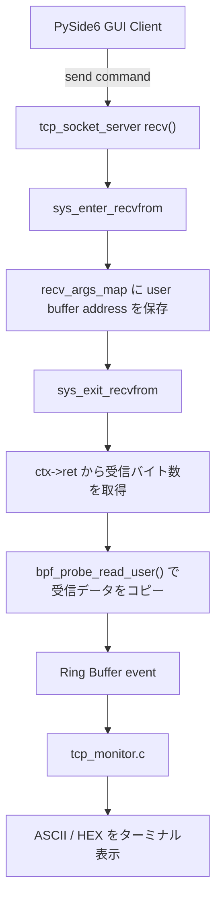

# eBPF TCP Monitor

[English version](README.md)

このディレクトリには、Linux 上の TCP 通信を観測する実験的な eBPF ベースの監視ツールを配置しています。

このモニタは TCP サーバや Python クライアントとは独立した監視ツールです。既存の TCP サーバ本体、クライアント、通信プロトコルの挙動は変更しません。

## 現在の監視内容

- `sys_enter_connect` に attach する
- `sys_enter_recvfrom` と `sys_exit_recvfrom` に attach する
- ENTER 側で受信バッファのアドレスを BPF Hash Map に保存する
- EXIT 側で `ctx->ret` から受信バイト数を取得する
- `bpf_probe_read_user()` でユーザー空間の受信バッファから最大64バイトをコピーする
- BPF Ring Buffer を使ってカーネル空間からユーザー空間へイベントを渡す
- 受信データをエスケープ済み ASCII 文字列と HEX で表示する
- `sudo ./tcp_monitor <pid>` で表示対象の PID を絞り込める

この実装により、TCP サーバが `PING\n`、`START\n`、`STOP\n` など、どのコマンド文字列を受信したかを確認できます。

## 動作確認スクリーンショット


スクリーンショットでは、`pgrep` で取得した TCP サーバの PID を `tcp_monitor` に渡し、PySide6 GUI クライアントから送信したコマンドに対応する `recv()` イベントだけをターミナルへ表示しています。

## event 構造体

```c
struct event {
    __u32 type;
    __u32 pid;
    char comm[16];

    __s64 bytes;
    __u32 data_len;
    unsigned char data[64];
};
```

## データフロー



## ファイル構成

```text
ebpf/
|-- Makefile
|-- README.md
|-- README.ja.md
|-- tcp_monitor.c
|-- tcp_monitor.bpf.c
`-- tcp_monitor.h
```

## 前提環境

確認対象の環境:

- Ubuntu 24.04 LTS
- clang
- gcc
- make
- libelf-dev
- zlib1g-dev
- pkg-config
- `~/libbpf-bootstrap` に libbpf-bootstrap を clone 済み
- `~/libbpf-bootstrap/examples/c` を事前に build 済み

必要なパッケージの例:

```bash
sudo apt install clang llvm make gcc libelf-dev zlib1g-dev pkg-config
```

先に libbpf-bootstrap を build します。

```bash
cd ~/libbpf-bootstrap/examples/c
make
```

この Makefile は、以下の生成物が存在することを前提にしています。

```text
~/libbpf-bootstrap/examples/c/.output/libbpf/libbpf.a
~/libbpf-bootstrap/examples/c/.output/bpftool/bootstrap/bpftool
~/libbpf-bootstrap/vmlinux.h/include/x86/vmlinux.h
```

## ビルド

```bash
cd ebpf
make
```

ビルドの流れ:

```text
tcp_monitor.bpf.c
  -> clang -target bpf
  -> .output/tcp_monitor.bpf.o
  -> bpftool gen skeleton
  -> .output/tcp_monitor.skel.h
  -> gcc + libbpf + libelf + zlib
  -> tcp_monitor
```

## 実行

eBPF プログラムのロードには、通常 root 権限が必要です。

```bash
sudo ./tcp_monitor
```

TCP サーバの PID だけに表示を絞る例:

```bash
pgrep tcp_socket_server
sudo ./tcp_monitor <pid>
```

出力例:

```text
TCP monitor started. Press Ctrl+C to stop.
RECV pid=55889 comm=tcp_socket_serv bytes=5 data_len=5 data="PING\n" hex=50 49 4E 47 0A
RECV pid=55889 comm=tcp_socket_serv bytes=6 data_len=6 data="START\n" hex=53 54 41 52 54 0A
RECV pid=55889 comm=tcp_socket_serv bytes=5 data_len=5 data="STOP\n" hex=53 54 4F 50 0A
```

終了するときは `Ctrl+C` を押します。

## クリーン

```bash
make clean
```

## 現在の制約

- `recvfrom()` からコピーする受信データは最大64バイト
- BPF プログラム側での port `5000` フィルタは未実装
- 接続先 IP アドレスとポート番号は未表示
- `accept`、`send`、`close` の監視は未実装
- TCP サーバ、クライアント、プロトコルは変更しない監視専用ツールとして扱う
