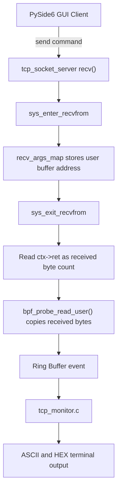

# eBPF TCP Monitor

[日本語版](README.ja.md)

This directory contains an experimental eBPF-based TCP monitor for Linux.

The monitor is separate from the TCP server and clients. It observes Linux system calls through tracepoints and prints connection and receive events from user space. It does not change the TCP server, clients, or protocol behavior.

## Current Scope

- Attach to `sys_enter_connect`.
- Attach to `sys_enter_recvfrom` and `sys_exit_recvfrom`.
- Store the receive buffer address on syscall ENTER with a BPF hash map.
- Read the return value on syscall EXIT to get the received byte count.
- Copy up to 64 received bytes from the user-space buffer with `bpf_probe_read_user()`.
- Send events from kernel space to user space with a BPF ring buffer.
- Print received data as an escaped ASCII string and as hexadecimal bytes.
- Optionally filter displayed events by process ID with `sudo ./tcp_monitor <pid>`.

The current implementation is useful for confirming which command strings the TCP server receives, such as `PING\n`, `START\n`, and `STOP\n`.

## Screenshot


The screenshot shows the TCP server PID being passed to `tcp_monitor`, then the monitor displaying only receive events for the TCP server process while commands are sent from the PySide6 GUI client.

## Event Structure

```c
struct event {
    __u32 type;
    __u32 pid;
    char comm[16];

    __s64 bytes;
    __u32 data_len;
    unsigned char data[64];
};
```

## Data Flow



## Files

```text
ebpf/
|-- Makefile
|-- README.md
|-- README.ja.md
|-- tcp_monitor.c
|-- tcp_monitor.bpf.c
`-- tcp_monitor.h
```

## Prerequisites

Tested target environment:

- Ubuntu 24.04 LTS
- clang
- gcc
- make
- libelf-dev
- zlib1g-dev
- pkg-config
- libbpf-bootstrap checked out at `~/libbpf-bootstrap`
- `~/libbpf-bootstrap/examples/c` built before this monitor

Install common packages:

```bash
sudo apt install clang llvm make gcc libelf-dev zlib1g-dev pkg-config
```

Build libbpf-bootstrap first:

```bash
cd ~/libbpf-bootstrap/examples/c
make
```

The Makefile expects these generated files:

```text
~/libbpf-bootstrap/examples/c/.output/libbpf/libbpf.a
~/libbpf-bootstrap/examples/c/.output/bpftool/bootstrap/bpftool
~/libbpf-bootstrap/vmlinux.h/include/x86/vmlinux.h
```

## Build

```bash
cd ebpf
make
```

Build flow:

```text
tcp_monitor.bpf.c
  -> clang -target bpf
  -> .output/tcp_monitor.bpf.o
  -> bpftool gen skeleton
  -> .output/tcp_monitor.skel.h
  -> gcc + libbpf + libelf + zlib
  -> tcp_monitor
```

## Run

Loading eBPF programs usually requires elevated privileges:

```bash
sudo ./tcp_monitor
```

Filter output to a specific TCP server process:

```bash
pgrep tcp_socket_server
sudo ./tcp_monitor <pid>
```

Example output:

```text
TCP monitor started. Press Ctrl+C to stop.
RECV pid=55889 comm=tcp_socket_serv bytes=5 data_len=5 data="PING\n" hex=50 49 4E 47 0A
RECV pid=55889 comm=tcp_socket_serv bytes=6 data_len=6 data="START\n" hex=53 54 41 52 54 0A
RECV pid=55889 comm=tcp_socket_serv bytes=5 data_len=5 data="STOP\n" hex=53 54 4F 50 0A
```

Stop with `Ctrl+C`.

## Clean

```bash
make clean
```

## Limitations

- `recvfrom()` payload copying is capped at 64 bytes.
- Port `5000` filtering is not implemented in the BPF program yet.
- Peer IP address and port are not displayed yet.
- `accept`, `send`, and `close` monitoring are not implemented yet.
- Intended as a monitoring tool; it does not modify the TCP server, clients, or protocol.
